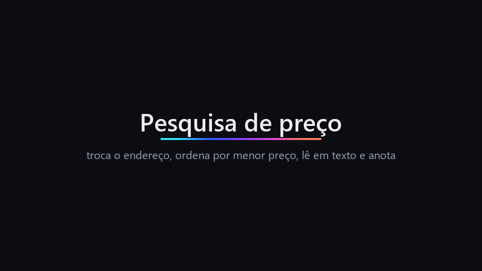
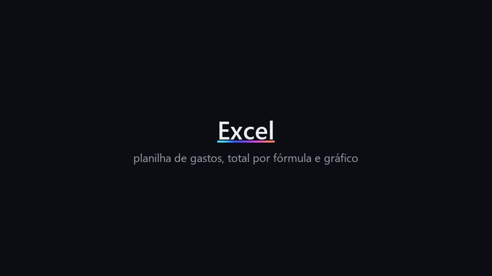
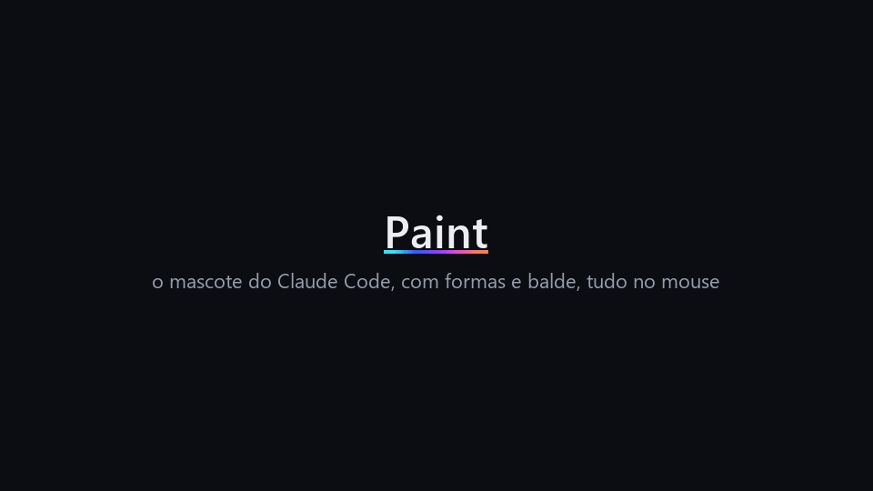
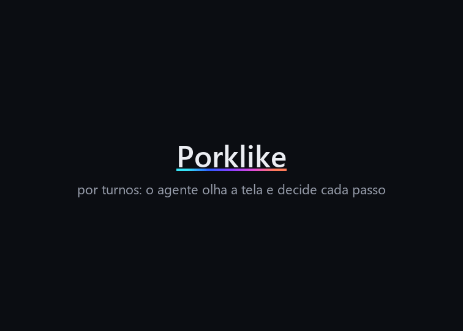

<div align="center">


# Tato Runtime

As mãos de um agente de IA: computador e navegador para qualquer agente que fala MCP.

Claude Code · Codex · Cursor · Gemini CLI

</div>

<p align="center">
  
</p>

O Tato Runtime é um servidor MCP que dá ao agente três ferramentas: `computador`,
`browser` e `gravacao`. O agente decide o que fazer; o Tato lê a interface, executa o
gesto, confere se ele fez efeito e devolve o resultado. Sempre que dá, ele lê a
estrutura da tela em texto antes de recorrer a uma imagem, o que deixa cada
passo mais barato e mais preciso.

Enquanto o agente usa a máquina, uma moldura mostra o que ele está fazendo, e
um atalho para tudo na hora.

## O que ele faz

### Computador

- **Enxerga pela estrutura:** lê os elementos da janela pela acessibilidade do
  sistema (UI Automation no Windows, AT-SPI no Linux) e o texto da janela da
  frente, com busca por termo. Recorre ao print só quando a estrutura não basta,
  e pode recortar e ampliar uma região pequena da tela.
- **Usa mouse e teclado:** clica por número de elemento ou por coordenada,
  digita, aperta combinações, segura teclas, manda sequências de teclas numa
  chamada, arrasta com botão do meio e modificadores, rola.
- **Confere cada gesto:** depois de agir, compara a tela com a de antes e diz se
  o gesto deu certo, se algo mudou ou se nada aconteceu, para o agente não
  repetir um clique que já funcionou.
- **Encontra programas:** lista o que está aberto, na bandeja e instalado, traz
  uma janela para a frente e abre programas pelo menu do sistema.
- **Espera a tela:** por um tempo fixo ou até a tela mudar, ignorando o que se
  anima sozinho.

<p align="center">
  
</p>

Também desenha: no Paint, o mascote do Claude Code sai com as formas, o balde e
o mouse.

<p align="center">
  
</p>

### Navegador

- A extensão do Chrome abre **uma aba própria por conversa**, num grupo com o
  nome do agente. O agente não alcança as outras abas da pessoa.
- Lê a página pela árvore de acessibilidade, pelo DOM, pelos dados
  estruturados e pelo console, e tira print só quando o texto não basta.
- Clica, preenche, rola e roda **roteiros**: uma sequência de passos com
  conferências no meio, que para no primeiro passo que não deu certo.
- Pela tela, pode navegar no Chrome da pessoa ou num perfil separado só do
  agente (veja [Configuração](#configuração)).

### Gravação local

- Quando a pessoa pede para gravar uma demonstração, `gravacao` inicia a captura
  **após aprovação específica**. Um aviso sempre visível mostra que a tela está
  sendo gravada e tem um botão **Parar**. Se o aviso não abrir, não há captura.
- `parar` finaliza; `estado` informa se a captura ainda corre. `ver` devolve
  **uma prancha com até 12 quadros**. No modo `mudancas`, mostra os instantes
  antes e depois das maiores alterações numa janela de até 30 segundos. Dá
  para ampliar uma `area` e estreitar `de`/`ate` em novas chamadas — útil para
  investigar algo que aparece e some sem enviar centenas de imagens ao agente.
- `montar` cria um GIF com cortes, velocidade, legendas, cartelas, recorte,
  esperas encurtadas e borrão por intervalo. Um trecho com outro `id` junta
  gravações locais finalizadas na ordem indicada.
- Os quadros e o GIF ficam só em `TATO_HOME/gravacoes/<id>`. O Tato não os envia
  para fora, não os publica e encerra a captura se a conexão MCP fechar. A
  captura para automaticamente em até 15 minutos. A gravação pelo MCP está
  disponível no Windows nesta primeira versão.

Por exemplo, depois de `iniciar` e `parar`, o agente pode procurar uma mudança
rápida e montar apenas os momentos escolhidos:

```json
{"acao":"ver","id":"<id devolvido por iniciar>","modo":"mudancas",
 "de":12,"ate":22,"area":[200,100,700,500],"amostras":8}
```

```json
{"acao":"montar","id":"<id devolvido por iniciar>","trechos":[
  {"titulo":"Pesquisa de preço"},
  {"de":12,"ate":35,"velocidade":3,"legenda":"Comparando as ofertas",
   "borrar":[
    {"de":15,"ate":19,"caixa":[10,20,150,80]}]}
]}
```

O modo `TATO_GRAVAR=1`, configurado **antes de iniciar o servidor**, inclui a
moldura do computador no vídeo; sem ele, a moldura fica fora da captura. O aviso
de gravação continua visível em ambos os modos. O GIF é para revisão local:
confira dados pessoais antes de compartilhar.

## Você no controle

- **Moldura na tela:** borda, seta própria no lugar do cursor, balão com o gesto
  e uma caixinha com as frases do agente, já que o chat fica atrás da janela.
  A moldura fica fora dos prints que o agente vê.
- **Atalho de parada:** `Ctrl + Alt + Shift + S` interrompe o gesto em curso, e
  nenhum gesto roda depois dele. O agente não consegue acionar esse atalho.
- **Aprovação:** o primeiro gesto de cada turno pede aprovação pelo cliente MCP.
  Leituras não pedem.
- **Não digita no lugar errado:** se outra janela vier para a frente, o teclado
  para, inclusive no meio de um texto.
- **Um agente por vez:** dois clientes não disputam o mesmo mouse e teclado.
- **O que ele nunca faz:** digitar senha (o agente clica no campo e usa o
  preenchimento automático do navegador) ou apertar combinações que derrubam a
  sessão ou apagam sem volta. Login e código de verificação passam para a
  pessoa com `pedir_a_pessoa`.
- **No navegador:** endereços internos da rede são recusados, e ações que
  enviam dados ou têm consequência pedem aprovação.

## Jogos por turnos

<p align="center">
  
</p>

Jogo por turnos funciona bem: o jogo espera enquanto o agente olha e decide.
O agente manda vários movimentos numa sequência e lê um recorte ampliado da
tela para enxergar o que está desenhado.

Jogos da demonstração, gratuitos e distribuídos pelos próprios autores, rodando
no emulador mGBA:

- **Porklike**, de Krystian Majewski e Lazy Devs, versão Game Boy de Ben Smith.
- **Tobu Tobu Girl Deluxe**, de Tangram Games, de código aberto.
- **Libbet and the Magic Floor**, de Damian Yerrick, sobre o Magic Floor de Martin Korth,
  software livre (licença zlib).

Jogo em tempo real não é o forte: cada volta de olhar e decidir leva alguns
segundos. No corte do Tobu Tobu Girl o agente pausa o emulador para pensar.

## Instalar

Requisitos: Python 3.11 ou mais novo; Windows 10 ou 11, ou Linux com X11;
Google Chrome para o navegador.

```bash
git clone https://github.com/Ryanleoncoder/tato-runtime.git
cd tato-runtime
pip install -e .
```

O Tato roda com `python -m tato`. Nos exemplos abaixo, `python` é o Python
onde você instalou; se usou um venv, ponha o caminho do Python dele.

### Registrar no seu agente

**Claude Code**

```bash
claude mcp add tato -- python -m tato --aprovacao-no-cliente
```

**Codex**, em `~/.codex/config.toml`:

```toml
[mcp_servers.tato]
command = "python"
args = ["-m", "tato"]
```

**Cursor** (`~/.cursor/mcp.json`) e **Gemini CLI** (`~/.gemini/settings.json`):

```json
{
  "mcpServers": {
    "tato": { "command": "python", "args": ["-m", "tato"] }
  }
}
```

`--aprovacao-no-cliente` é para cliente que já pede aprovação antes de cada
chamada de ferramenta, como o Claude Code. Sem ele, o Tato pergunta pelo
próprio protocolo MCP.

### Extensão do navegador

Uma vez só: em `chrome://extensions`, ative o modo do desenvolvedor, escolha
"Carregar sem compactação" e selecione a pasta `tato/extensao`. Ela se conecta
sozinha quando o agente inicia o Tato. Detalhes no
[guia da extensão](tato/extensao/README.md).

## Configuração

Tudo por variável de ambiente, com padrões que funcionam sem configurar nada.

| Variável | Padrão | O que faz |
|---|---|---|
| `TATO_COMPUTADOR_ATALHO` | `ctrl+alt+shift+s` | Atalho de parada. |
| `TATO_COMPUTADOR_RITMO` | `1` | Com `0`, o ritmo automático digita rápido em todo programa, não só nos editores. |
| `TATO_COMPUTADOR_DESLIZAR` | `1` | O mouse desliza até o alvo; `0` pula direto. |
| `TATO_GRAVAR` | `0` | Com `1`, a moldura aparece em gravações de tela (OBS, Xbox Game Bar, Ferramenta de Captura). Ela também entra no print que o agente recebe. Só no Windows. |
| `TATO_NAVEGADOR_PERFIL` | `pessoa` | Em que Chrome navegar pela tela: `pessoa` (o seu, com suas contas) ou `agente` (perfil separado). |
| `TATO_NAVEGADOR_AGENTE_NOME` | `Agente` | Nome do perfil separado: vira "Chrome do <nome>". Crie o atalho com `python -m tato.computador.perfil_do_agente <nome>`. |
| `TATO_BROWSER_OCIOSO_MIN` | `0` | Fecha a sessão do navegador depois de tantos minutos parada; `0` não fecha. |
| `TATO_ORIGENS_LOCAIS_LIBERADAS` | vazio | Endereços locais que o navegador pode abrir, como `http://localhost:3000`, separados por vírgula. |
| `TATO_PORTA` | `47812` | Porta local onde a extensão encontra o Tato. |
| `TATO_HOME` | `~/.tato` | Onde o Tato guarda o que precisa entre execuções. |

## Ações

### `computador`

| Ação | O que faz |
|---|---|
| `ver` | Print da tela; com `marcar`, numera os elementos; com `regiao`, recorta e amplia. |
| `elementos` | Elementos da janela em foco pela acessibilidade, sem imagem. |
| `ler` | Texto da janela da frente; com `procurar`, só as linhas com o termo. |
| `janelas` | Janelas abertas e qual está em foco. |
| `programas` | Programas abertos, na bandeja e instalados. |
| `abrir` / `focar` / `fechar` | Abre um programa pelo menu do sistema / traz uma janela para a frente / fecha uma janela como o X dela (o programa ainda pergunta se quer salvar). |
| `clicar`, `clicar_duas`, `clicar_direito`, `mover` | Por número de elemento ou coordenada do print. Clique por coordenada depois de outros gestos confere se a tela em volta do alvo ainda é a do print; `confiar_no_print` libera quando a mudança é esperada. |
| `arrastar` / `rolar` | Com botão e modificadores. |
| `digitar` | Texto no campo em foco, com `ritmo`: `natural` (pausas de mão, para sites), `rapido`, `instantaneo` (tudo de uma vez) ou `automatico` (rápido em editores locais, natural no resto). |
| `tecla` | Uma combinação, segurada por um tempo, ou uma `sequencia` de teclas. Aceita letras, números, teclas especiais e `= - , .` (o zoom é `ctrl+=` e `ctrl+-`). |
| `invocar` / `definir_valor` | Aciona ou preenche um elemento pela acessibilidade, sem mouse. |
| `esperar` | Tempo fixo ou `ate_mudar`. |
| `pedir_a_pessoa` / `encerrar` | Passa a vez para a pessoa / libera a sessão. |

Todo gesto aceita `dizer`: uma frase curta que aparece na caixinha da moldura.

### `browser`

| Ação | O que faz |
|---|---|
| `navegar` | Abre um endereço e devolve a árvore da página com referências. |
| `snapshot` | Lê a página de novo. |
| `clicar` / `digitar` / `rolar` | Pela referência ou pelo texto do elemento. |
| `roteiro` | Vários passos de uma vez, com `esperar`, `conferir` e `pensar` no meio. |
| `imagens` | Print da página, quando o texto não basta. |
| `console` | Mensagens do console da página. |
| `encerrar` | Encerra a sessão do navegador. |

### `gravacao`

| Ação | O que faz |
|---|---|
| `iniciar` | Começa a gravar a tela, com aprovação e aviso visível; aceita `fps`, `largura`, `caixa` e `minutos`. |
| `parar` / `estado` | Finaliza a gravação / diz se ela ainda corre. |
| `ver` | Uma prancha com até 12 quadros, por `intervalo` ou pelas maiores `mudancas`, com `de`, `ate` e `area`. |
| `montar` | O GIF a partir de `trechos` (cortes, cartelas, legendas, velocidade, recorte, borrão); `nome` dá nome ao arquivo. |

## Como funciona

- Na conexão, o servidor manda ao agente, como instruções MCP, o que vale para
  as três ferramentas: qual usar, falar pela moldura, passar o login para a
  pessoa e encerrar ao terminar. Cada ferramenta descreve só o próprio uso.
- O servidor fala MCP por stdio. Cada chamada envia progresso e aceita
  cancelamento; uma chamada que não volta a tempo é abandonada e o agente
  recebe o motivo.
- O primeiro Tato que sobe abre a porta local da extensão; os outros passam os
  comandos por ele.
- A moldura segue na tela enquanto a sessão estiver aberta; `encerrar` a tira.

## Limites

- Jogos em tempo real: lentos demais para o ciclo de olhar e decidir.
- Jogos online: não use. Automatizar partidas é proibido na maioria dos jogos, e
  sistemas anti-cheat detectam a entrada simulada.
- Janelas de administrador: o Windows não deixa um programa comum controlar uma
  janela elevada.
- macOS e Linux com Wayland ainda não são suportados.

## Desenvolvimento

```bash
pip install -e ".[dev]"
python -m pytest
node --test tato/extensao/service-worker.test.cjs
```

Os testes de Linux (X11 e AT-SPI) rodam só onde há Xvfb; no Windows eles são
pulados.

## Licença

[MIT](LICENSE).
